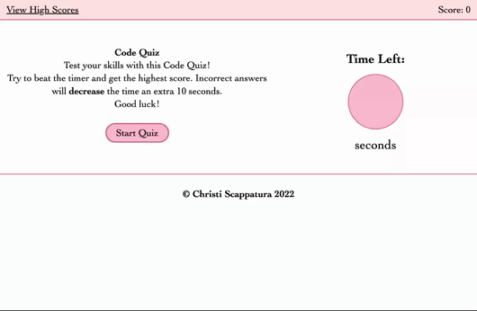

# Code Quiz

## Description

A short code quiz designed to test our knowledge of JavaScript and Web API's.

This project was mainly focused on further building skills in JavaScript and expanding our skillset into learning about Web API's. We learned how to make dynamic designs that are interactive for a more engaging user experience.

I found this project to be quite a challenge as JavaScript is taking me a little longer to grasp compared to HTML and CSS. I think the most challenging part is learning how to think computationally to solve problems as the come up. 

I do, however, feel that I've improved (at least a little!) upon my JavaScript abilities compared to the last project.

---

## Usage
View deployed application on [GitHub Pages](https://jazzberriess.github.io/wk-04-code-quiz/)

Link to the [GitHub repo](https://github.com/jazzberriess/wk-04-code-quiz)

Built using HTML, CSS and JavaScript.

---

## Demo

---

## Resources
The following websites were invaluable in my quest for knowledge and troubleshooting:

* [Stack Overflow: How to place and center text in an svg rectangle](https://stackoverflow.com/questions/5546346/how-to-place-and-center-text-in-an-svg-rectangle)

* [Stack Overflow: How to add onclick event to start timer](https://stackoverflow.com/questions/54637148/how-to-add-onclick-event-to-start-timer)

* [Stack Overflow: How to clear an .appendChild in JavaScript](https://stackoverflow.com/questions/57514020/how-to-clear-an-appendchild-in-javascript)

* [Simple Javascript Quiz](https://www.sitepoint.com/simple-javascript-quiz/)

* [Stack Overflow: Score Counter](https://stackoverflow.com/questions/26125762/i-need-a-javascript-round-counter-and-score-counter-for-my-game_)

* [Stack Overflow: Checking if a Key exists](https://stackoverflow.com/questions/16010827/html5-localstorage-checking-if-a-key-exists)

* [Mozilla Developer Network: MDN Web Docs JavaScript](https://developer.mozilla.org/en-US/docs/Web/JavaScript)

* [Mozilla Developer Network: MDN Web Docs Web API's](https://developer.mozilla.org/en-US/docs/Web/API)

* [W3 Schools](https://www.w3schools.com/js/)

* Class notes and recordings from Week 4

* Fellow classmates, instructor and TA's

* AskBCS

---

## License

MIT License

Copyright (c) 2022 Christi Scappatura
