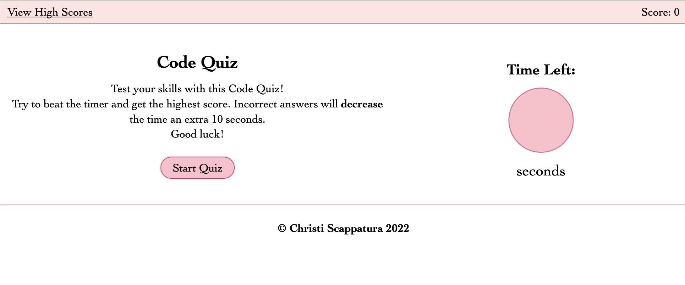

# Code Quiz

## Description

A short interactive code quiz designed to test your knowledge of JavaScript and Web API's.

Users have 60 seconds to answer 6 questions relating to JavaScript and Web API's. Incorrect answers give you a time penalty. The game is over when you either run out of time or complete the questions.

---

## Usage
View deployed application on [GitHub Pages](https://jazzberriess.github.io/code-quiz/)

Link to the [GitHub repo](https://github.com/jazzberriess/code-quiz)

## Technologies Used
Built using: 
* HTML
* CSS
* JavaScript
* localStorage Web API

---

## Demo

---

---

---

---

---

## Resources
The following websites were invaluable in my quest for knowledge and troubleshooting:

* [Stack Overflow: How to place and center text in an svg rectangle](https://stackoverflow.com/questions/5546346/how-to-place-and-center-text-in-an-svg-rectangle)

* [Stack Overflow: How to add onclick event to start timer](https://stackoverflow.com/questions/54637148/how-to-add-onclick-event-to-start-timer)

* [Stack Overflow: How to clear an .appendChild in JavaScript](https://stackoverflow.com/questions/57514020/how-to-clear-an-appendchild-in-javascript)

* [Simple Javascript Quiz](https://www.sitepoint.com/simple-javascript-quiz/)

* [Stack Overflow: Score Counter](https://stackoverflow.com/questions/26125762/i-need-a-javascript-round-counter-and-score-counter-for-my-game_)

* [Stack Overflow: Checking if a Key exists](https://stackoverflow.com/questions/16010827/html5-localstorage-checking-if-a-key-exists)

* [Mozilla Developer Network: MDN Web Docs JavaScript](https://developer.mozilla.org/en-US/docs/Web/JavaScript)

* [Mozilla Developer Network: MDN Web Docs Web API's](https://developer.mozilla.org/en-US/docs/Web/API)

* [W3 Schools](https://www.w3schools.com/js/)

---

## License

MIT License

&copy; 2022 Christi Scappatura

## Contact

[Christi on GitHub](https://github.com/jazzberriess)
